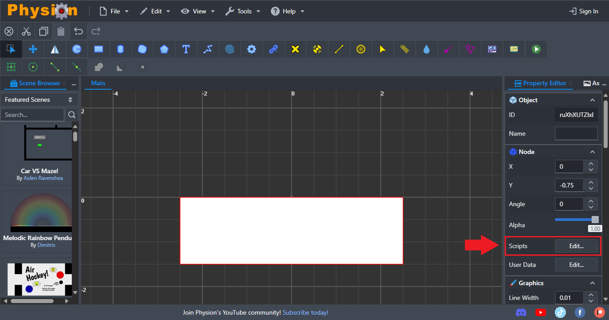

> [!NOTA]
> Esta instrucción asume que estás utilizando la configuración de diseño predeterminada.
# Cómo implementar un script en Physion:
## Selecciona la carpeta Scripts.

## Selecciona un script.

## Copia el archivo en bruto.

## Ve a app.physion.net.

## Crea una nueva escena.
### 1.

### 2.

## Abre la Biblioteca de Activos.
### 1.

### 2.

## Crea un activo de Javascript.
### 1.

### 2.

## Pega el archivo en bruto.

## Aplica el script.

## Cierra la Biblioteca de Activos.

## Aplica el script al nodo.
### 1.

### 2.

### 3.

